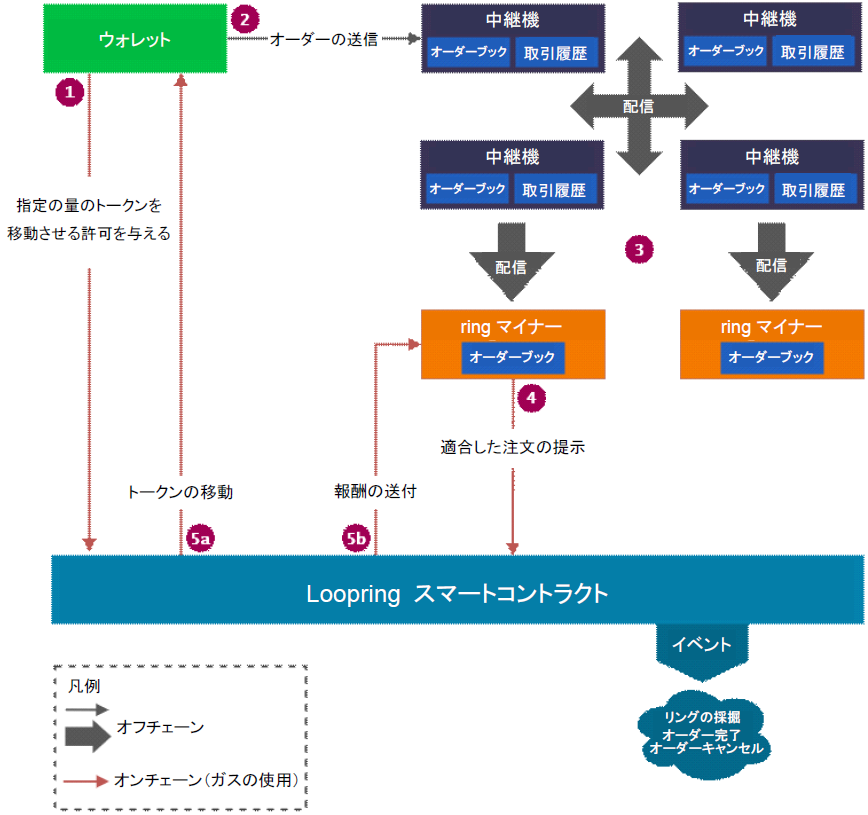
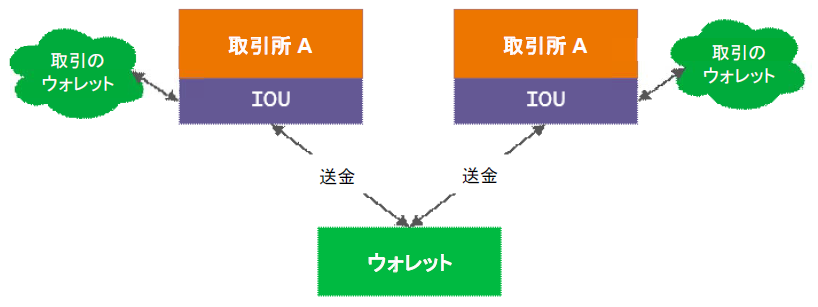

# Loopring（ループリング）とは

ループリングは、分散型取引所プロトコルです。このプロトコルは、ループリングの分散型取引所システムのコアとなる、イーサリアムのスマートコントラクトとして実装されます。ループリングには、以前から用いられている中央集権型の取引所に比べて、以下のような優位性があります。

* **取引相手と取引所に関するリスクの軽減:** トークンを第三者である取引所に預け、保管するリスクは無くなります。また、オーダーによってトークンはロックされません。
* **高い流動性:** オーダーがリングマッチされることにより、あらゆる取引ペアにおいて高い流動性を実現します。
* **公平性:** 手数料と割引モデルは、すべての関係者（メーカー、テイカー、マイナー）の間で公平性を担保します。
* **分散性:** システム全体が完全に分散化されています。

ホワイトペーパーでは、ループリングプロトコルの背景と一般的な設計について詳しく知ることができます。プロトコルの実装を進めていくに従って、[ホワイトペーパー](https://github.com/Loopring/whitepaper/raw/master/en_whitepaper.pdf)の詳細の一部が古くなる可能性があります。
相違がある場合は、最新の公式アップデートが記載されている当ウェブサイトを参照してください。

## なぜループリングが必要か
ループリングプロトコルは、中央集権型の取引所にみられる多くの問題に対処できるように設計されています。主な問題点については、このページの[最後のセクション](overview.md#中央集権型取引所の問題点)にまとめてありますのでご覧ください。

# エコシステム
ここでは、ループリングエコシステムの主要部分と、それらがどのようにして相互に機能するかを説明します。このシステムは中央集権型の取引所が提供している全ての機能を備えています。詳細については、以下のリンクをクリックしてください。

**ウォレット**
> ループリングネットワークへのオーダーの送信や、トークンへのアクセスを可能にする一般的なウォレットサービス/インターフェイスです。

**Relays（中継機、リレー）**
> オーダーブックやトレード履歴を維持します。他のリレーやRingマイナーに新規オーダーを配信します。
> リングマッチによって呼び出した注文を照合する方法を決定しようとします。これには高い計算負荷がかかり、完全なオフチェーンで行われます。このプロセスでは、少なくとも2つのトークンを含む一連の取引が生成されます。これを[order ring](./projects/protocol.md#注文リング)と呼びます。

**[ループリングプロトコル スマートコントラクト](./projects/protocol.md)**
> マイナーから受け取ったリングマッチされたオーダーを鑑査する一連のスマートコントラクトのことで、ユーザーの代わりにトークンの転送を行い、マイナーにインセンティブを与え、イベントを起こします。リレー/オーダーブラウザは、これらのイベントを確認し、オーダーブックと取引履歴を最新の状態に保ちます。

**アセットトークン化サービス**
> ループリング上で直接取引することのできないアセット同士の橋渡しをします。これは信頼できる企業や組織によって運営されている中央集権的なサービスです。ユーザーは自分の資産（別のチェーンからのフィアットまたはトークン）を入金し、トークンを発行することができます。トークンを返還することにより、ユーザーへ預金が返却されます。LRCはクロスチェインの取引所プロトコルではありませんが、このサービスを使用することで、他のブロックチェーンの資産だけでなく、物的資産を持つEthereum ERC20トークンを交換することができます。

> このサービスはループリングプロジェクトの一部ではありません。

## 概要
以下に、ループリングネットワーク上でオーダーが成功した際の各ステップごとの手順が示されています。 

 
**0 - ユーザーがトレードしようとする**
> ユーザーが`X`の金額の`TokenA`と`Y`の金額の`TokenB`の取引を行いたいとします。このペアの現在のレートとオーダーブックは、リレーやネットワーク上に接続されている他のインターフェイス（例えば、オーダーブックブラウザ）によって提供される複数のソースで確認することができます。準備が整うと、ユーザーは注文の詳細を入力して提示するためにウォレットインタフェースを使用します。LRCの金額をマイナーへの手数料としてオーダーに追加することができます。手数料が高いオーダーは、マイナーによってより早く処理される可能性が高くなります。

**1 - ERC20認証**
> ウォレットは、ユーザが売却したい`X`の金額の`TokenA`をループリングスマートコントラクトが処理することを許可します。この処理ではユーザーのトークンはロックされません。オーダーがネットワークによって処理されている間、トークンを自由に移動することができます。送信者の残高がある時点（マイナーまたはループリングによって）で確認され、資金が不足している場合、減額されたものとみなされます。減額されたオーダーはキャンセルとはみなされず、不足していた金額がウォレットに入金されれば自動的に元の金額まで増額されます。しかしながら、キャンセルは一方向の手動操作であり、元に戻すことはできません。

**2 - オーダーをネットワークに送信する**
> 処理が許可されると、オーダーデータは送信者の秘密鍵で署名されます。その後、ウォレットは署名されたオーダーをネットワーク内の1つ以上のノード（リレーまたはRingマイナー）に送信します。

**3 - 配信**
> オーダーを受け取ると、リレーは公開されているオーダーブックを更新し、できるだけ迅速にオーダーの処理を開始するためにオーダーを他のリレーおよびRingマイナーに配信します。

**4 - Ring マイナー（オーダーマッチング）**
> Ringマイナーはオーダーを受け取り、オーダーブックに追加します。それぞれのマイナーは、指定された交換レートで一部もしくはすべてのオーダーを完了させようとします。リングマッチングというプロトコルを用いることが、どのようなペアであっても高い流動性を提供できる主な理由です。プロセスの詳細についてはページを参照してください。
ユーザがオーダーしたレートよりも高い場合、その金額はリング内のすべてのオーダー間で共有され、マージンスプリットと呼ばれます。マイナーは、手数料として、マージンスプリットを請求してLRCを返却するか、LRCを手数料として取得するかのいずれかを選ぶことができます。

**5 - 検証と決済**
> リングは、ループリングプロトコルコントラクトによって受け取られます。これは、マイナーの供給データを確認し、（リング内のオーダーの充足率とユーザーのウォレットのトークンに応じて）リングを完全にまたは部分的に清算できるかどうかを判断する複数のチェックを行います。すべてのチェックが通過した場合、コントラクトはトークンをユーザーに転送し（5a）、同時にマイナーへ手数料を支払う（5b）。この操作はアトミックです。

オーダーがループリングネットワークに入ったときに何が起こっているのかを理解しやすくするため、いくつかの詳細は省略されています。プロトコル（オーダーキャンセル、リングマッチング、オーダーブック、トレード履歴の同期など）の理解を深めたい場合は、上記の[エコシステム](overview.md#エコシステム)の主要部分の文書をご覧ください。

# 中央集権型取引所の問題点
ループリングなどのシステムの必要性をよりよく理解するためには、まず、中央集権型取引所モデルの問題点を指摘する必要があります。

ここでは、トークンを従来の中央集権型取引所に送るときに何が起こるかを簡潔に示しています。
 
 

取引所を使用してトークンを交換するには、まず取引所にトークンを入金しなければなりません。トークンは取引所のウォレットに送られ、取引所は借方の証明である借方証書（IOU）送ります。その後、IOUを他のユーザーのIOUと交換します。最後に、引き出したい場合は、IOUを取引所に返却します。取引所は、あなたのトークンを外部ウォレットアドレスに送り返します。

**セキュリティの欠如**
> このモデルでは、自分のトークンを管理することができません。取引所で速やかな取引が可能ですが、多くのリスクが伴います。自分の資産（アカウントの凍結、取引所のダウン、ハッキング、開発者のミスなど）を失う可能性のある状況が複数考えられます。

**透明性の欠如**
> 取引所のウォレットにトークンを預けているときに、トークンに何かが起こる可能性があります。何かが起きたとしても、あなたはそれを正確に知る方法がありません。取引所が倒産するなどの問題を知ることができても時すでに遅く、トークンの返却は叶わないでしょう。

**流動性の欠如**
> 取引所でサポートされているトークンペアでのみ取引できます。流動性が低い場合は、他の取引所で取引をすることができます。トレードしたいトークンのペアがサポートされていない場合は、他のペアとの間接取引を行い、必要なものを取得したり、交換する必要があります。いずれの場合においても、複数回の取引を行わなければならず、手数料を余計に支払うことになります。

中央集権型の取引所が直面する課題はほかにもあります。ここではそれら全てについて議論することはできませんので、ウェブ上の関連する記事を読むことをお勧めします。
