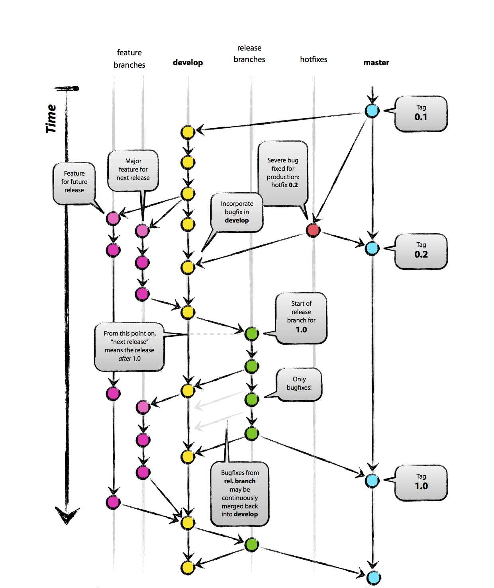

# Contribution

## How to contribute

We use [Slack](slack.com) to communicate with each other. Feel free join in our slack channels:

- [Loopring Announcement (read-only)](https://loopring-team.slack.com/messages/C60UCUECV)
- [Loopring Community (English)](https://loopring-team.slack.com/messages/C6NTLGX3P)
- [Loopring Contributors](https://loopring-team.slack.com/messages/G77R2BQUV)

You may want to talk to Daniel Wang ([daniel@loopring.org](mailto:daniel@loopring.org)), Loopring CEO and major developer, about your idea and the way you can help. This is not a prerequisite, however, you can create pull requests at anytime.

## Our Git Branching Model

For git repositories that have releases (this one not included), we will adopt ["A Successful Git Branching Model"](http://nvie.com/posts/a-successful-git-branching-model/) starting from Nov. 1st, 2017.

## Contributors

If your pull requests are ever accepted and merged, please create a pull request to put yoruself in this list.

- Fei YUAN -  Reviewed LRC token smart-contract and created an important pull request.