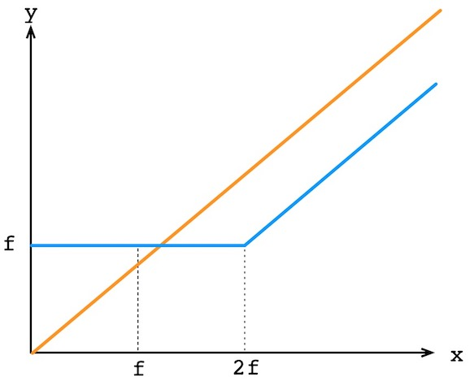

# The loopring smart contracts
(A rework is being made)

Loopring Protocol (the Protocol) is a Ethereum smart-contract. It is the core of Loopring ecosystem and offers the following functionalites:

- **Computing each order's current state**

	When orders are propagated off-chain, they never mutate, which means even when they are partially filled or cancelled, in the peer-to-peer network, different parties still see the same exact orders - otherwise orders need to be re-signed each time they get partially filled or cancelled. The protocol will verify the order's signature against its original state and compute order's current state based on the order's fill history, cancellation records, and its corresponding outgoing address's balance as well ERC20 allowance. All future matching and price/fee calculation is based on order's current states.

- **Verifying Miner-supplied Values**

	Because of the lack of float number computing capalibity, Loopring demands ring-miners to calculate the amount of token each order should pay to the next/previous order in the ring. The protocol shall verify these amounts as well as fees to be collected by miners are calculated correctly. Price and fee calculation deserve a detailed articulation, thus they have their own dedicated sections below.

- **Transfering Tokens for Settlement**

	The protocol will transfer ERC20 tokens between order addresses by using the [TokenTransferDelegate](https://github.com/Loopring/protocol/blob/master/contracts/TokenTransferDelegate.sol). The introduction of such a delegate makes upgrading Loopring protocol easier as all orders only need to authorize this delegate instead of different versions of the protocol.

- **Cancel or Partially Cancel Orders**

	Orders can be cancelled by invoking the `cancelOrder` protocol method. The other way to pseudo-cancel an order is to move all funds into a different address from the one the order's signed by. We may need to provide a batchCancelOrder method in next version.

- **Maitaining Fill History and Emit Events**

	In order to compute each order's current state, the protocol keeps track of each order's total filled amount and cancelled, aka fill/cancellation-records. The protocol also emit `OrderFilled`, `OrderCancelled`, and `RingMined` events. These events can be used by relays to provide consolidated trading data to wallet users.

Loopring protocol is open-source at github: [https://github.com/Loopring/protocol](https://github.com/Loopring/protocol). We are still working on its very first release.

## Order Rings

supersimmetry {[da447m@yahoo.com](mailto:da447m@yahoo.com)} came up with this 《[Remarks on Loopring](../pdf/supersimmetry-loopring-remark.pdf)》 document to explain what order-rings (match-ring) are, when orders can form a valid ring to be filled, and how fill rates are calculated. We really appreciate such an effort and it is worth of a reading. Please be noted in current protocol implementation, the pricing model is the same as in our whitepaper and the above document, but the fee model is different.

When impelmented in solidity, Loopring protocol doesn't perform calculating exchange rate or amount, but perform verification of miner-supplied exchange amount for each order (specificily, how much each order should pay to the previous order in the ring). This is beause 1) solidity doens't have support for float number computation, especially `pow(x, 1/n)`, and 2) we prefer math computation to be done by miners to save gas.

## Exchange Rate Verification
Below we are going to describe how rate related verification is done.

(TODO)

## Fee Model

Our [whitepaper](https://github.com/Loopring/whitepaper/raw/master/en_whitepaper.pdf) elaberated a possible income source for ring-miners called "margin split" or 'split'. The nice thing about split is that ring-miners' interests and order submitters' interests are aligned - the more ring-miners help save order submitter's cost, the more the ring-miners will gain as income.

But in situations where the actually exchange rates in a ring are exactly the same as each order's original rates, the margin is zero thus the split is also zero, therefore ring-miners are not incentivized to submit such a ring as they have no income at all. With the introduction of LRC token, we allow order submitter to specify the amount of LRC to be paid to miners as mining fee. This mining fee is paid proportionally if an order is partially filled.

The innovative part of our fee model is as follows: we only allow ring-miners to choose either LRC fee or split, additionally, if ring-miners choose split, they must pay back the same amount of LRC back to order submitter as specifed.

Lets say a order specified 10LRC as fee, assume this order is fully filled and split is 10S (S is the selling token), the miner either collect 10LRC as fee, or collect 10S and pays 10LRC to order submitter.

If `f` is LRC fee, `x` is the split, then miner's income is `y = max(f, x-f)`. If we plot this function, we have:

### The Rationals

The orange line represents the split fee model, and the blue line represents our current fee model. As you can see:

- if split is 0, miners will choose `f` so they still get a constant income, therefore they are certainly incentivized.
- if `f`, the LRC fee is zero, `y = max(f, x-f)` becomes `y = x`, this is exactly the fee model without LRC involved. So our fee model is just a genelized model.
- if split's value is equal to or greater than twice the value of LRC fee, miner will choose `x-f`.

(TODO)

